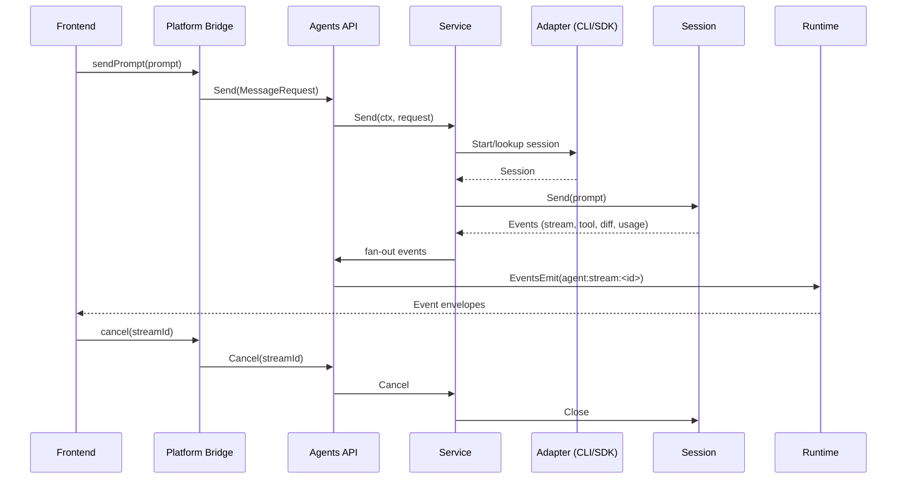

# Codex Doc Sync

You are a senior engineer and technical writer helping maintain high-quality documentation. Analyze the provided git diff plus contextual documentation excerpts and determine whether any existing docs must change to remain accurate. Only modify files that are listed as allowed documentation targets. Prefer updating in-place docs before suggesting new files.

## Responsibilities

1. Compare the current code diff with the existing docs to identify stale explanations, missing steps, or new behaviors that require documentation.
2. For each documentation change you can confidently apply yourself, produce a unified diff patch against the existing file using `--- a/<path>` / `+++ b/<path>` headers.
3. Limit automatic edits to at most 5 files per run. Skip binary assets and generated files. Never change code files in this workflow.
4. If you discover work that cannot be handled safely (e.g., missing docs, large rewrites), add a follow-up item describing what needs to happen and why instead of guessing.

## Output Instructions

- Respond with JSON that conforms to the provided schema. `edits` should contain concrete patches ready for `git apply`. Each edit must include the relative file `path`, the `patch`, and a concise `justification` (13 sentences).
- Patches must be consistent with the supplied file content. Include enough context lines so that `git apply --unified=3` succeeds.
- Do not restate the entire file when only a section changes. Modify the smallest relevant section.
- When no documentation changes are required, return an empty `edits` array and explain why in `summary`.

## Reference Material

The sections below provide the inputs you need (changed files, git diff, allowed documentation files, and excerpts of those docs). Use them to decide what to edit.

## Changed files

```
.github/workflows/doc-sync.yml
```

## Git diff

```diff
diff --git a/.github/workflows/doc-sync.yml b/.github/workflows/doc-sync.yml
new file mode 100644
index 0000000..1af7473
--- /dev/null
+++ b/.github/workflows/doc-sync.yml
@@ -0,0 +1,21 @@
+name: Doc Sync On Command
+permissions:
+  contents: write
+  pull-requests: write
+on:
+  workflow_dispatch:
+  pull_request:
+    types: [opened, synchronize, reopened]
+
+jobs:
+  doc-sync:
+    if: >
+      github.event_name == 'workflow_dispatch' ||
+      (github.event_name == 'pull_request' && github.actor == github.repository_owner)
+    uses: activadee/codex-shared-workflows/.github/workflows/doc-sync.yml@main
+    secrets: inherit
+    with:
+      doc_globs: |
+        README.md
+        AGENTS.md
+        docs/**/*.md
```

## Allowed documentation files

- AGENTS.md
- README.md
- docs/adr/0001-generic-agent-io.md
- docs/components/files-panel.md
- docs/components/manage-project-dialog.md
- docs/components/project-sidebar.md
- docs/components/thread-terminal.md
- docs/components/workspace-shell.md
- docs/features/conversation.md
- docs/features/diffs.md
- docs/features/projects.md
- docs/features/streams.md
- docs/features/terminal.md
- docs/features/threads.md
- docs/features/workspace.md
- docs/routes/new-thread-route.md
- docs/routes/project-landing.md
- docs/routes/thread-route.md
- docs/routes/workspace-context.md
- docs/routes/workspace-landing.md
- docs/routes/workspace-layout.md

## Documentation excerpts

# Documentation Context

## README.md (score 14)
```markdown
# README

## About

Wails desktop app with a refactored backend following a modular internal/ layout.

You can configure the project by editing `wails.json`. More information about the project settings can be found
here: https://wails.io/docs/reference/project-config

## Live Development

To run in live development mode, run `wails dev` in the project directory. This will run a Vite development
server that will provide very fast hot reload of your frontend changes. If you want to develop in a browser
and have access to your Go methods, there is also a dev server that runs on http://localhost:34115. Connect
to this in your browser, and you can call your Go code from devtools.

## Backend Structure

- `internal/projects`: project service + Wails API
- `internal/agents`: agent service + Wails API (streams, threads, diffs, PRs)
- `internal/terminal`: PTY manager + Wails API
- `internal/attachments`: clipboard/image persistence API
- `internal/watchers`: per-thread FS watchers with debounced diff emission
- `internal/storage`: sqlite, migrations, repositories, app data path helper
- `internal/ui`: simple UI-related APIs (e.g., SelectProjectDirectory)
- `internal/git/worktrees`: git worktree manager
- `main.go`: composition root (opens DB, migrates, wires services, binds APIs)

## Agent Models & Codex CLI

- codex-ui targets Codex CLI `rust-v0.58.0` or newer so the GPT-5.1 family (`gpt-5.1-codex`, `gpt-5.1-codex-mini`, `gpt-5.1`) is available everywhere the composer exposes model choices.
- The composer defaults to `gpt-5.1-codex` with a Medium reasoning level to match the upstream presets, but you can still pick legacy GPT-5 options when needed.

## Build

- Generate Wails bindings: `wails generate module`
- Build Go backend: `go build ./...`
- Build frontend: `cd frontend && npm ci && npm run build`

## Doc Sync Workflow

- `.github/workflows/doc-sync.yml` runs the shared `activadee/codex-doc-sync` job to keep Markdown + `docs/**` files aligned with each PR.
- The workflow now triggers automatically on `pull_request` events (`opened`, `synchronize`, `reopened`) when the actor matches the repository owner, so repo-owned branches get doc checks without leaving comments.
- Maintainers can also press **Run workflow** from the Actions tab (the workflow has `workflow_dispatch` enabled) to retrigger the sync for community PRs or after manual fixes.
- The job has `contents` + `pull-requests` write permissions so it can commit `[skip ci][doc-sync]` updates directly back to the PR branch.

```

## docs/adr/0001-generic-agent-io.md (score 6)
```markdown
# ADR 0001: Adopt Generic Agent I/O Port (CLI-first, Codex via godex)

- **Status**: Proposed
- **Date**: 2025-11-09
- **Epic**: [#67](https://github.com/activadee/codex-ui/issues/67)
- **Issue**: [#68](https://github.com/activadee/codex-ui/issues/68)

## Context
- codex-ui is a Wails desktop app (Go backend, Vite/TS frontend) that currently hardcodes a single Codex adapter wired through `internal/agents/service.go` and emitted via `wailsjs/go/agents/API`.
- The frontend has already migrated to a platform bridge + Zustand store, but it still assumes `StreamEvent` payloads produced by Codex-specific DTOs (`AgentItemDTO`, `ThreadOptionsDTO`).
- Product goals for the Generic Agent I/O epic (#67) require codex-ui to act as a **thin UI for any agent CLI or SDK** (Codex, Claude Code, Gemini CLI, fake agents, etc.) without reworking the frontend each time.
- Existing backend coupling makes it expensive to add new agents: every adapter must copy `CodexAdapter` patterns, re-implement stream lifecycle, and expose bespoke DTOs to the UI.

## Problem & Forces
1. **Adapter rigidity** – `internal/agents/Adapter` exposes a single `Stream(ctx, MessageRequest)` method. Every provider must understand Codex DTOs and streaming contracts that mix transport + domain concepts.
2. **Transport conflation** – `MessageRequest` bundles prompts, thread metadata, sandbox hints, and UI-only flags; `StreamEvent` mixes telemetry, diffs, todo lists, and terminal signals. This makes CLI agents (JSONL/text streams) hard to integrate and restricts capability negotiation.
3. **Testing blind spots** – Without a generic interface, we cannot ship a deterministic fake adapter or CLI smoke tests (issues #71, #80) because the surface forces Codex-specific behaviours.
4. **Frontend stability** – The UI needs a predictable prompt/event envelope regardless of adapter type so future slices/features (agent picker, renderer) can trust the same semantics.

## Decision Summary
Introduce a **Generic Agent Port** consisting of `Adapter` + `Session` interfaces plus shared data contracts (Prompt, Segment, Event). All adapters (CLI or SDK) implement this port. We keep Codex via the `godex` SDK by wrapping it behind the new session interface. CLI-first concerns drive the reusable runtime runner, while Codex remains a first-class adapter that benefits from the same abstractions. `agents.yaml` manifest and registry wiring are deferred to issue #73 per scope agreement.

## Architecture Overview
- **Adapter registry** – `internal/agents/connector` defines interfaces, DTOs, and helper factories. Each adapter registers itself with metadata (id, default capabilities, launch hints).
- **Session lifecycle** – `Adapter.Start(ctx, SessionOptions) (Session, error)` returns a long-lived session bound to a workspace/worktree. The session can accept multiple prompts (`Send`) and emits events until closed.
- **Service integration** – `internal/agents/service.go` owns repository/worktree orchestration, instantiates adapters via registry entries, and proxies events to Wails runtime topics (unchanged topic naming).
- **Frontend contract** – `frontend/src/platform/wailsBridge.ts` keeps the same IPC surface, but the payloads it receives now follow the new Prompt/Event schema. Feature slices consume selectors already designed for stream-first data, so they only need type updates.

### Component diagram
```mermaid
graph TD
  UI[Frontend (Zustand + EventBus)] -->|Send prompt| Bridge[Platform Bridge]
  Bridge --> AgentsAPI
  subgraph Backend
    AgentsAPI[Wails Agents API]
    Service[internal/agents.Service]
    Registry[Agent Registry]
    AdapterCLI[CLI Adapter]
    AdapterSDK[Codex godex Adapter]
    Runner[CLI Runner]
    Godex[github.com/activadee/godex]
    Service --> Registry
    Registry --> AdapterCLI
    Registry --> AdapterSDK
    AdapterCLI --> Runner
    AdapterSDK --> Godex
    AdapterCLI --> Service
    AdapterSDK --> Service
  end
  Service -->|Events| Runtime[Wails Runtime Topics]
  Runtime --> UI
  Service --> Watchers[File Watchers]
  Service --> Terminal[Terminal Manager]
```

### Sequence diagram (prompt lifecycle)


## Interface Specification
```go
// Adapter lives under internal/agents/connector
type Adapter interface {
    ID() string
    Start(ctx context.Context, opts SessionOptions) (Session, error)
    Capabilities() CapabilitySet
}

// Session represents a live conversation with an agent instance.
type Session interface {
    Send(ctx context.Context, prompts ...Prompt) error
    Events() <-chan Event
    Capabilities() CapabilitySet
    Close() error
}

type SessionOptions struct {
    ProjectID int64
    Thread discovery.Thread
    WorkingDir string
    SandboxMode string
    Env map[string]string
}

type Prompt struct {
    ID        string
    Author    PromptAuthor // user/system/tool
    Segments  []PromptSegment
    Metadata  map[string]any
}

type PromptSegment struct {
    Kind   SegmentKind // text, code, image, file
    Text   string
    Path   string
    Lang   string
}

type Event struct {
    Type       EventType
    PromptID   string
    Payload    any // concrete structs per type
    Usage      *TokenUsage
    Timestamp  time.Time
}
```
- **Capabilities** – boolean map for features like `supportsImages`, `supportsReasoni
```

## docs/features/conversation.md (score 6)
```markdown
# Conversation Feature

## Purpose
Normalizes and stores agent/user/system conversation entries per thread, enabling timeline hydration, optimistic inserts during streaming, and preview synchronization with threads.

## Structure
- **Domain**: `domain/conversation/index.ts` exports `normaliseConversation`, cloning agent/user/system DTO payloads into immutable entries with consistent IDs.
- **State**: `features/conversation/state/conversationSlice.ts` keeps `conversationByThreadId`, loading/error flags, and exposes actions (`loadConversation`, `ensureConversation`, `updateConversationEntries`, `clearConversation`). It interacts with `platformBridge.threads.loadConversation` for hydration.
- **Hooks**: `features/conversation/hooks/useThreadConversation.ts` is a thin selector-based hook that auto-loads the timeline when a thread becomes active and provides `setConversation` + `refetch` helpers for controllers.
- **Workspace Controllers**: `useConversationManager` (in `features/workspace/hooks`) orchestrates higher-level behaviors: appending user entries, upserting agent entries during streams, syncing previews, and deriving thread sections.
- **Tests**: `features/conversation/state/conversationSlice.test.ts` covers load/ensure/update flows with mocked bridge responses.

## Data Flow
1. Workspace controller calls `useThreadConversation(threadId)` to get entries + helpers.
2. When streams emit events, `useStreamLifecycle` delegates to `useConversationManager` which relies on `conversationSlice` actions to append/merge entries.
3. `threadsSlice` listens for `clearConversation` during thread deletion to keep slices consistent.

## Notes
- The slice intentionally keeps raw `ConversationEntry` objects so upstream components (timeline, preview chips, diff inspectors) can share the same data without adaptation layers.
- By exposing `ensureConversation`, controllers (e.g., `useStreamLifecycle`) can guarantee a timeline exists before pushing optimistic entries, avoiding null checks throughout the UI.

```

## docs/features/streams.md (score 6)
```markdown
# Streams Feature

## Purpose
Manages the lifecycle of agent streams (start/cancel, per-thread state, event handling) and acts as the bridge between Wails agent bindings, the EventBus, and workspace controllers.

## Structure
- **State**: `features/streams/state/streamsSlice.ts` stores `threadStreams` keyed by thread ID with `status`, `usage`, `error`, `streamId`. It exposes `setThreadStreamState` and `resetThreadStream` for controllers/hooks.
- **Hook**: `features/streams/hooks/useAgentStream.ts` is the primary interface. It:
  - Guards against concurrent streams per thread.
  - Calls `platformBridge.threads.sendMessage` / `.cancelStream` for side effects.
  - Subscribes to stream events via `useThreadEventRouter` and publishes diagnostics on the EventBus.
  - Updates the slice so any component can read current stream state.
- **Workspace Integration**: `useStreamLifecycle` (workspace hook) composes `useAgentStream` with conversation/thre ad controllers to handle optimistic entries, attachments, and preview syncing.

## Notes
- The hook emits lifecycle events (start/cancel/error) to the EventBus so future tooling (record/replay) can observe them without touching the hook implementation.
- Slice-backed state enables components like status bars or stream indicators to read stream info without prop drilling.

```

## docs/features/threads.md (score 6)
```markdown
# Threads Feature

## Purpose
Represents agent threads per project, handles selection, optimistic updates (rename/delete), and maps backend DTOs into UI-ready entities with derived metadata (preview text, sections, timestamps).

## Structure
- **Domain**: `domain/threads` contains DTO mappers plus helpers like `threadToListItem`, `formatThreadSections`, and `updateThreadPreview`. Every slice/controller relies on these pure functions.
- **State**: `features/threads/state/threadsSlice.ts` stores normalized thread arrays keyed by project, active thread IDs, loading/error flags, and thread→project maps. It exposes actions (`loadThreads`, `refreshThread`, `renameThread`, `deleteThread`, `createPullRequest`, etc.).
- **Hooks**: `features/threads/hooks/useAgentThreads.ts` wraps the slice selectors, triggers hydration when the active project changes, and computes sections via the domain helpers.
- **Workspace Controllers**: `features/workspace/controllers/useThreadActions.ts` and `useWorkspaceController.ts` consume the slice through the hook to drive UI interactions (select, rename, delete, new thread routes).
- **Tests**: `features/threads/state/threadsSlice.test.ts` uses generated DTOs to assert optimistic updates, refresh flows, and error handling.

## Data Flow
1. `useProjects()` sets the active project → `useAgentThreads(projectId)` triggers `loadThreads` when it sees an unhydrated project.
2. Slice actions call `platformBridge.threads.*` and reconcile responses into normalized state.
3. Domain helpers keep derived views (sections, previews) in sync without duplicating logic across components.
4. Workspace routing listens to `workspace.threads` selectors to keep the URL and UI selection aligned.

## Notes
- Thread deletion clears associated conversation/diff state via callbacks stored on the slice; this keeps dependent features consistent without extra wiring in controllers.
- Optimistic rename retains the previous preview/last-timestamp values until the next backend refresh, ensuring UI stability during concurrent events.

```

## docs/features/workspace.md (score 6)
```markdown
# Workspace Feature

## Purpose
Coordinates all other features (projects, threads, conversation, streams, terminal, diffs) into the desktop workspace experience: routing, sidebar, composer, dialogs, controllers, and stream lifecycle management.

## Structure
- **Hooks**: `features/workspace/hooks` contains `useWorkspaceController` (the main façade), `useConversationManager`, `useStreamLifecycle`, and `useThreadSelection`. These compose domain hooks/slices into UI-facing models.
- **Controllers**: `features/workspace/controllers` hosts focused hooks (`useMessageSender`, `useThreadActions`, `usePendingAttachments`, `useStreamErrors`) that encapsulate imperative logic.
- **Routing & UI Helpers**: `features/workspace/routing/useWorkspaceRouting.ts` keeps the URL in sync with store state; `features/workspace/ui/*` provides composer/sidebar/dialog helpers built on top of the controller state.
- **Entry Points**: `routes/WorkspaceLayout.tsx` + `routes/workspace-context.ts` import everything exclusively through the feature barrels, keeping the route layer thin.

## Data Flow
1. `useWorkspaceController` pulls selectors from project/thread/conversation/stream slices and exposes structured objects (`workspace.projects`, `workspace.threads`, etc.).
2. Workspace routing uses this controller to drive navigation and to reset composer state on thread changes.
3. UI components (sidebar, composer, thread routes) consume either the controller or the context, never touching slices or bridges directly.

## Notes
- Because controllers live alongside the feature, testing/mocking becomes easier: each controller exports plain hooks that can be swapped during tests.
- Future workspace sub-features (e.g., workbench, notifications) can slot into this structure by adding new controllers/ui modules without breaking the routing or store boundaries.

```

## docs/routes/thread-route.md (score 6)
```markdown
# ThreadRoute

## Path
`/projects/:projectId/threads/:threadId`

## Purpose
Renders the active thread conversation/stream UI. It consumes workspace context and composer helpers to show the timeline, stream status, and composer.

## Behavior
1. Reads `workspace` from context to access `threads.active`, `conversation.list`, `stream` state.
2. Ensures `workspace.threads.select()` is called via routing hook, so state + URL stay synced.
3. Displays system/user/agent entries with components bound to conversation slice selectors.
4. Surfaces stream errors/status from `workspace.stream` and composer state to the UI.

## Notes
- ThreadRoute never fetches data directly; all queries go through the workspace controller/slices.
- New thread creation is handled by `NewThreadRoute`; once a thread is active, ThreadRoute becomes responsible for the view.

```

## docs/routes/workspace-layout.md (score 6)
```markdown
# WorkspaceLayout Route

## Purpose
Top-level route mounted for `/projects/*`. It wires up the Workspace feature to the UI shell:
- Instantiates `useWorkspaceController` (projects, threads, conversation, streams, etc.).
- Provides composer, dialog, and routing helpers via the workspace context.
- Renders the `WorkspaceShell` with sidebar, composer, and nested routes (`ThreadRoute`, `ProjectLanding`, `NewThreadRoute`).

## Responsibilities
1. **State orchestration** – obtains the `workspace` object (with `projects`, `threads`, `stream`, etc.) and memoizes props for the sidebar/composer.
2. **Routing glue** – uses `useWorkspaceRouting` to keep URL params in sync with selected project/thread and to reset the composer when navigating.
3. **Composer actions** – wires `useComposerState` to the workspace stream controller, handling prompt submission and attachments.
4. **Dialogs** – integrates `useWorkspaceDialogs` for project selection/register flows.
5. **Outlet context** – supplies `WorkspaceRouteContextValue` to nested routes so they can read `workspace` and composer controls without prop drilling.

## Related Files
- `src/routes/workspace-context.ts`
- `src/features/workspace/hooks/useWorkspaceController.ts`
- `src/features/workspace/routing/useWorkspaceRouting.ts`
- `src/features/workspace/ui/*`

```

## docs/components/files-panel.md (score 4)
```markdown
# FilesPanel Component

## Location
`src/components/app/files-panel.tsx`

## Purpose
Displays per-thread file diff stats and PR actions. Consumes the diffs feature hook and threads slice actions.

## Data Flow
1. Calls `useThreadFileDiffs(threadId)` to fetch/select diffs.
2. Uses `useAppStore` selectors for `refreshThread` + `createPullRequest` so it can refresh PR metadata and trigger PR creation.
3. Uses `runtimeServices.openExternal` to open PR URLs.

## Behavior
- Shows diff counts with added/removed lines.
- Offers “Create PR” / “Open PR” buttons depending on `prUrl` state.
- Provides manual refresh button (calls `refresh()` from the hook).
- Displays action and load errors inline.

## Notes
- Diff state lives entirely in the slice; the component never touches the bridge directly.
- Pending PR creation state (`isCreatingPr`) lives locally since it is component-specific UI concern.

```

## docs/components/manage-project-dialog.md (score 4)
```markdown
# ManageProjectDialog Component

## Location
`src/components/app/manage-project-dialog.tsx`

## Purpose
Handles UI for registering a new project workspace from the desktop app. Presents a modal dialog with project path/name inputs.

## Behavior
- Consumes props provided by `useWorkspaceDialogs` (open/close state, error, submitting flag, directory picker callback).
- Calls the passed `onSubmit` to trigger `workspace.projects.register`.
- Shows inline validation/error messages when registration fails.

## Notes
- The actual dialog state (open, error message) lives in the workspace feature hook so the component stays presentational.

```

## docs/components/project-sidebar.md (score 4)
```markdown
# ProjectSidebar Component

## Location
`src/components/app/project-sidebar/index.tsx`

## Purpose
Renders the left sidebar listing projects and their threads. Provides UI for selecting/renaming/deleting threads and adding projects.

## Inputs (derived from workspace controller)
- Projects list + active project
- Thread sections (grouped via domain helpers)
- Loading flags for projects/threads
- Callbacks: `onProjectDelete`, `onAddProject`, `onNewThread`, `onThreadSelect`, `onThreadRename`, `onThreadDelete`

## Behavior
- Shows active project details and CTA buttons.
- Groups threads using the precomputed sections (In Progress, Older, Archived).
- Surfaces loading skeletons when `isLoadingProjects` or `isLoadingThreads` are true.

## Notes
- Stateless; all data/actions come from `workspace` controller hooks.
- Integrates with routing by calling the passed callbacks which ultimately drive the slices and router.

```

## docs/components/thread-terminal.md (score 4)
```markdown
# ThreadTerminal Component

## Location
`src/components/app/thread-terminal/thread-terminal.tsx`

## Purpose
Wraps the terminal feature hook (`useThreadTerminal`) and renders terminal output/status for the active thread.

## Responsibilities
- Calls `useThreadTerminal(threadId)` to manage session start/stop, write, resize, and subscribe to events.
- Registers a listener to render streaming output via `<pre>` blocks.
- Exposes UI buttons for sending input and clearing output.

## Notes
- All terminal state (status, error, exit code) is sourced from the slice; the component only renders.
- Cleanup automatically stops the backend terminal session via the hook’s effect.

```
