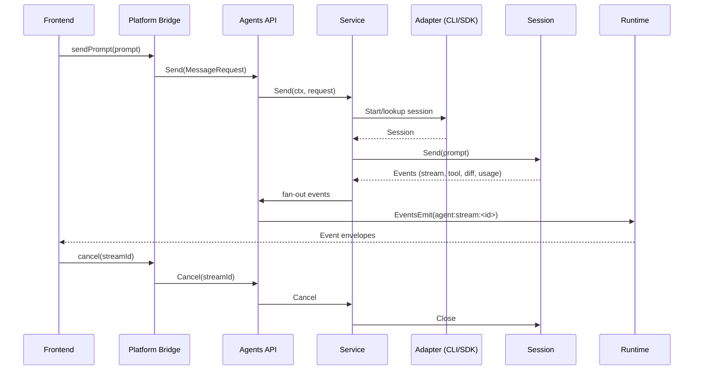

# ADR 0001: Adopt Generic Agent I/O Port (CLI-first, Codex via godex)

- **Status**: Proposed
- **Date**: 2025-11-09
- **Epic**: [#67](https://github.com/activadee/codex-ui/issues/67)
- **Issue**: [#68](https://github.com/activadee/codex-ui/issues/68)

## Context
- codex-ui is a Wails desktop app (Go backend, Vite/TS frontend) that currently hardcodes a single Codex adapter wired through `internal/agents/service.go` and emitted via `wailsjs/go/agents/API`.
- The frontend has already migrated to a platform bridge + Zustand store, but it still assumes `StreamEvent` payloads produced by Codex-specific DTOs (`AgentItemDTO`, `ThreadOptionsDTO`).
- Product goals for the Generic Agent I/O epic (#67) require codex-ui to act as a **thin UI for any agent CLI or SDK** (Codex, Claude Code, Gemini CLI, fake agents, etc.) without reworking the frontend each time.
- Existing backend coupling makes it expensive to add new agents: every adapter must copy `CodexAdapter` patterns, re-implement stream lifecycle, and expose bespoke DTOs to the UI.

## Problem & Forces
1. **Adapter rigidity** – `internal/agents/Adapter` exposes a single `Stream(ctx, MessageRequest)` method. Every provider must understand Codex DTOs and streaming contracts that mix transport + domain concepts.
2. **Transport conflation** – `MessageRequest` bundles prompts, thread metadata, sandbox hints, and UI-only flags; `StreamEvent` mixes telemetry, diffs, todo lists, and terminal signals. This makes CLI agents (JSONL/text streams) hard to integrate and restricts capability negotiation.
3. **Testing blind spots** – Without a generic interface, we cannot ship a deterministic fake adapter or CLI smoke tests (issues #71, #80) because the surface forces Codex-specific behaviours.
4. **Frontend stability** – The UI needs a predictable prompt/event envelope regardless of adapter type so future slices/features (agent picker, renderer) can trust the same semantics.

## Decision Summary
Introduce a **Generic Agent Port** consisting of `Adapter` + `Session` interfaces plus shared data contracts (Prompt, Segment, Event). All adapters (CLI or SDK) implement this port. We keep Codex via the `godex` SDK by wrapping it behind the new session interface. CLI-first concerns drive the reusable runtime runner, while Codex remains a first-class adapter that benefits from the same abstractions. Adapter discovery now loads from `agents.yaml` (repo root) via `internal/config/agents.go`, which hydrates `internal/agents/registry` so new agents can ship as manifest updates.

## Architecture Overview
- **Adapter registry** – `internal/agents/connector` defines interfaces, DTOs, and helper factories. Each adapter registers itself with metadata (id, default capabilities, launch hints) sourced from `agents.yaml` and loaded through `internal/config/agents.go`.
- **Session lifecycle** – `Adapter.Start(ctx, SessionOptions) (Session, error)` returns a long-lived session bound to a workspace/worktree. The session can accept multiple prompts (`Send`) and emits events until closed.
- **Service integration** – `internal/agents/service.go` owns repository/worktree orchestration, instantiates adapters via registry entries, and proxies events to Wails runtime topics (unchanged topic naming).
- **Frontend contract** – `frontend/src/platform/wailsBridge.ts` keeps the same IPC surface, but the payloads it receives now follow the new Prompt/Event schema. Feature slices consume selectors already designed for stream-first data, so they only need type updates.

### Component diagram
```mermaid
graph TD
  UI[Frontend (Zustand + EventBus)] -->|Send prompt| Bridge[Platform Bridge]
  Bridge --> AgentsAPI
  subgraph Backend
    AgentsAPI[Wails Agents API]
    Service[internal/agents.Service]
    Registry[Agent Registry]
    AdapterCLI[CLI Adapter]
    AdapterSDK[Codex godex Adapter]
    Runner[CLI Runner]
    Godex[github.com/activadee/godex]
    Service --> Registry
    Registry --> AdapterCLI
    Registry --> AdapterSDK
    AdapterCLI --> Runner
    AdapterSDK --> Godex
    AdapterCLI --> Service
    AdapterSDK --> Service
  end
  Service -->|Events| Runtime[Wails Runtime Topics]
  Runtime --> UI
  Service --> Watchers[File Watchers]
  Service --> Terminal[Terminal Manager]
```

### Sequence diagram (prompt lifecycle)


## Interface Specification
```go
// Adapter lives under internal/agents/connector
type Adapter interface {
    ID() string
    Start(ctx context.Context, opts SessionOptions) (Session, error)
    Capabilities() CapabilitySet
}

// Session represents a live conversation with an agent instance.
type Session interface {
    Send(ctx context.Context, prompts ...Prompt) error
    Events() <-chan Event
    Capabilities() CapabilitySet
    Close() error
}

type SessionOptions struct {
    ProjectID int64
    Thread discovery.Thread
    WorkingDir string
    SandboxMode string
    Env map[string]string
}

type Prompt struct {
    ID        string
    Author    PromptAuthor // user/system/tool
    Segments  []PromptSegment
    Metadata  map[string]any
}

type PromptSegment struct {
    Kind   SegmentKind // text, code, image, file
    Text   string
    Path   string
    Lang   string
}

type Event struct {
    Type       EventType
    PromptID   string
    Payload    any // concrete structs per type
    Usage      *TokenUsage
    Timestamp  time.Time
}
```
- **Capabilities** – boolean map for features like `supportsImages`, `supportsReasoningLevel`, `supportsSandbox`, `emitsDiffs`, `emitsTerminal`, `supportsApply`. Service uses these to enable/disable UI affordances.
- **Prompt authors** – `system`, `user`, `assistant`, `tool`. Future UI renderer can style these consistently.
- **Segment kinds** – minimal core: `text`, `code`, `markdown`, `imageLocal`, `attachmentRef`. Additional kinds can be negotiated via capabilities to avoid breaking older adapters.

### DTO compatibility mapping
| Current DTO | Replacement | Notes |
|-------------|-------------|-------|
| `MessageRequest` | `Prompt` + `SessionOptions` | Thread metadata moves to `SessionOptions`; prompts can batch segments. |
| `InputSegmentDTO` | `PromptSegment` | Adds segment kind + optional language to support CLI hints. |
| `StreamEvent` | `Event` | Event.Type becomes enum (`item.created`, `plan.updated`, `tool.started`, `tool.completed`, `diff.summary`, `usage.updated`, `session.error`). |
| `AgentItemDTO` | Event payload structs (`AgentMessage`, `CommandRun`, `ToolCall`, `DiffChunk`, `TodoList`) | Aligns CLI JSON entries with frontend renderer needs. |

Service maintains shims that translate between legacy DTOs and new structs so the UI migration can be incremental. Once frontend completes issues #76–#79, we can drop the old DTOs.

## CLI-first Adapter & Runner
- **Runner responsibilities**:
  - Spawn agent CLI binaries with inherited sandbox constraints (reuse `internal/git/worktrees` + worktree manager for working dir binding).
  - Stream stdout/stderr lines, parse JSONL envelopes, and emit `Event` structs via channels.
  - Support backpressure via bounded channels and context cancellation to avoid runaway CLI processes.
  - Heartbeat + idle timeout detection; if CLI stops sending heartbeats, kill the process and emit `session.error` event.
  - Structured logging hook (bridge to `internal/logging`).
- **Envelope schema** (CLI agents must emit):
  ```json
  {"type":"item","role":"assistant","text":"Hello"}
  {"type":"command","status":"running","command":"ls"}
  {"type":"diff","path":"main.go","added":5,"removed":2}
  {"type":"usage","input":123,"output":456}
  {"type":"complete","status":"succeeded"}
  ```
  Runner maps these into `Event` variants. Unknown `type` values are wrapped in `Event{Type:"custom"}` for forward compatibility.
- **Sandbox + security**: Runner only allows workspace-relative writes (leveraging existing worktree manager). Apply diff automation stays out-of-scope per issue #68 acceptance; UI continues manual review workflow.
- **Fake agent**: Issue #71 will add `cmd/fakeagent` that emits deterministic JSONL for tests (#80). Runner must accept injected command path + env to facilitate this.

## Codex via godex Adapter
- **Why keep godex**: supports streaming, multimodal segments (text/image), sandboxing hints, and usage metrics without shelling out to CLI.
- **Integration**:
  - Adapter implements the new `Adapter` interface; `Start` effectively wraps `NewCodexAdapter` but now returns a `Session` that stores the `godex.Thread` handle.
  - `PromptSegment` → `godex.InputSegment` mapping: `text` → `godex.TextSegment`, `code`→`TextSegment` with language tag in metadata, `imageLocal`→`godex.LocalImageSegment`.
  - `Session.Send` converts prompts plus `SessionOptions` (model, reasoning level, sandbox) into `godex.ThreadOptions` + `TurnOptions`.
  - Streaming events from `godex` map to new `Event` types; usage events remain intact. File diff + todo info continues to flow through existing watchers and persistence logic.
- **Env/config**: `CODEX_API_KEY`, `CODEX_BASE_URL`, `CODEX_PATH` overrides remain supported via `CodexOptionsFromEnv`. Adapter advertises capabilities `supportsImages=true`, `supportsReasoningLevel=true`, `emitsDiffs=true`.
- **Testing**: Issue #81 adds smoke tests gated behind env vars; ADR calls for shared fixtures/mocks within `internal/agents/connector/mocks` so we can simulate streaming without hitting Codex.

## Migration Strategy
1. **Port introduction (#69)** – Add `internal/agents/connector` package with interfaces/types, plus conversion helpers for legacy DTOs.
2. **CLI base adapter (#70)** – Implement runner + adapter skeleton that can spawn any CLI described in config.
3. **Fake agent & tests (#71, #80)** – Provide deterministic CLI for integration/tests.
4. **Codex adapter rewrite (#72, #81)** – Wrap godex SDK with new session interface, maintain current behaviour.
5. **Registry + manifest (#73)** – Load adapters from `agents.yaml`, inject into service.
6. **Wails service wiring (#74, #75)** – Update agents API/service/main.go to use registry + port.
7. **Frontend updates (#76–#79)** – Refresh types, store slices, agent picker, and renderer to consume new prompt/event schema.
8. **Tooling & docs (#82–#85)** – Scripts, security hardening, telemetry, and developer guide updating refer back to this ADR for expectations.

Each step can ship independently because adapters expose shims until both backend and frontend consume the new schema. Feature flags around non-Codex agents can guard early releases.

## Risks & Mitigations
| Risk | Impact | Mitigation |
|------|--------|------------|
| Event schema drift between adapters | UI inconsistencies | Centralize Event structs in connector package; add JSON schema tests + fake agent validation. |
| CLI processes escaping sandbox | Security | Runner enforces worktree root, configurable env allowlist, and kill-switch on timeout. |
| Codex regression during refactor | Blocked users | Keep legacy Codex adapter until new one passes smoke tests; gate new registry behind feature flag. |
| Frontend type churn | Slows rollout | Provide temporary type guards + adapter-to-DTO translator so UI changes land gradually.

## Consequences
- Adding a new agent requires only implementing the port + registry entry; frontend remains untouched beyond capability-driven UI toggles.
- CLI-first architecture encourages deterministic tests and fake agents, making CI coverage achievable without external dependencies.
- Codex continues to function with improved abstractions, enabling parallel work on CLI adapters without destabilizing existing users.

## Acceptance
- This ADR file checked in under `docs/adr/0001-generic-agent-io.md` with Mermaid diagrams (per user guidance).
- Interfaces, runner goals, Codex integration, agents manifest/config wiring (`agents.yaml` + `internal/config/agents.go`), and migration plan documented for downstream contributors.
